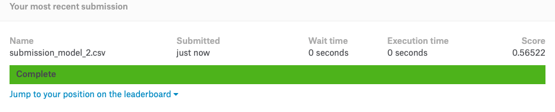

```{r setup, include=FALSE}
# Load all your packages here:
library(tidyverse)
library(yardstick)

# Set default behavior for all code chunks here:
knitr::opts_chunk$set(
  echo = TRUE, warning = FALSE, message = FALSE,
  fig.width = 16/2, fig.height = 9/2
)

# Set seed value of random number generator here. This is in order to get
# "replicable" randomness, so that any results based on random sampling or
# resampling are replicable everytime you knit this file. Why use a seed value
# of 76? For no other reason than 76 is one of my favorite numbers:
# https://www.youtube.com/watch?v=xjJ7FheCkCU
set.seed(76)
```

You will be submiting an entry to Kaggle's [DonorsChoose.org Application Screening: Predict whether teachers' project proposals are accepted](https://www.kaggle.com/c/donorschoose-application-screening/){target="_blank"} by fitting a **logistic regression** model $\hat{f}(x)$.


***


# EDA

Read in data provided by Kaggle for this competition. They are organized in the `data/` folder of this RStudio project:

```{r}
training <- read_csv("data/train.csv")
test <- read_csv("data/test.csv")
sample_submission <- read_csv("data/sample_submission.csv")
```

Before performing any model fitting, you should always conduct an exploratory data analysis. This will help guide and inform your model fitting. 

## Look at your data!

Always, ALWAYS, **ALWAYS** start by looking at your raw data. This gives you visual sense of what information you have to help build your predictive models. To get a full description of each variable, read the data dictionary in the `data_description.txt` file in the `data/` folder.

Note that the following code chunk has `eval = FALSE` meaning "don't evaluate this chunk with knitting" because `.Rmd` files won't knit if they include a `View()`:

```{r, eval = FALSE}
View(training)
glimpse(training)

View(test)
glimpse(test)
```

In particular, pay close attention to the variables and variable types in the
`sample_submission.csv`. Your submission must match this exactly.

```{r}
glimpse(sample_submission)
```

## Data wrangling

As much as possible, try to do all your data wrangling here:

```{r}
training <- training %>%
  select(id,teacher_number_of_previously_posted_projects,project_grade_category,project_is_approved)

test <- test %>%
  select(id,teacher_number_of_previously_posted_projects,project_grade_category)
```


***


# Minimally viable product

## Fit model on training

Fit a logistic regression model $\widehat{f}_1$ with only an intercept term on all the training data. In other words, your model will not use any predictor variables. Save this in `model_1`. What is the uniquely fitted probability?


```{r}
# Fit a logistic regression model. Note the use of glm() instead of lm()
model_1 <- glm(project_is_approved ~ 1, family = "binomial", data = training)

# 2.b) Extract point-by-point info of points used to fit model
fitted_points_logistic_1 <- model_1 %>%
  broom::augment()
```
The fited probability is 0.8476823.

```{r}
# The .fitted values are the fitted log-odds however, NOT fitted probabilities.
# We convert to fitted probabilities using inverse-logit function:
fitted_points_logistic_1 <- fitted_points_logistic_1 %>%
  mutate(fitted_prob = 1/(1 + exp(-.fitted)))  %>%
  select(project_is_approved, fitted_prob)
       #y_hat = ifelse(fitted_prob>0.5, 1, 0))  #we don't need to set a threshold because we will fit it to all different thresholds in this case
fitted_points_logistic_1

```


## Estimate of your Kaggle score

Use the `yardstick` package to get an estimate of your Kaggle score: the area under the ROC curve (AUC). Crossvalidation is not necessary as with no predictor variables, we are in very little danger of overfitting the model. 


```{r}
#transform the truth to factor and with level ordered
truth_levels<-c(1, 0)

fitted_points_logistic_1<-fitted_points_logistic_1%>%
  mutate(project_is_approved = factor(project_is_approved, levels = truth_levels))

#computing AUC
roc_auc(fitted_points_logistic_1, project_is_approved,
        predicted = fitted_prob)


```


## Make predictions on test

Apply your `model_1` fitted model to the test data. What is the uniquely predicted probability?

```{r}
predicted_points_logistic_1 <- model_1 %>%
  broom::augment(newdata = test)
predicted_points_logistic_1 <- predicted_points_logistic_1%>%
  mutate(fitted_prob = 1/(1 + exp(-.fitted))) %>%
  select(fitted_prob)
predicted_points_logistic_1
```


## Create your submission CSV

```{r}
submission_mvp<- sample_submission %>% 
  mutate(project_is_approved = predicted_points_logistic_1$fitted_prob) %>% 
  write_csv(path = "data/submission_model_1.csv")
```


## Screenshot of your Kaggle score

Our score based on our submission's "Area under the Receiver Operating Characteristic Curve" was 0.5.

{ width=100% }

The estimated AUC is 0.50. This is equal to the actual Kaggle score of 0.50.

***


# Due diligence

## Plot ROC curve

Use the `yardstick` package to plot the ROC curve:

```{r}
#visualize the ROC plot
autoplot(roc_curve(fitted_points_logistic_1, project_is_approved, fitted_prob))
```


***


# Reaching for the stars

## Fit model on training

Fit a logistic regression model $\widehat{f}_2$ using a single numerical predictor variable $x$ on all the training data. Save this in `model_2`. Then display a single visualization that shows:

* The relationship between outcome variable $y$ and your numerical predictor variable $x$ with black points
* The relationship between the fitted probabilities $\widehat{p}$ from model $\widehat{f}_2$ and your numerical predictor variable $x$ with a red curve
* The fitted probabilities $\widehat{p}$ from model $\widehat{f}_1$ with a horizontal blue line

at the same time.

```{r}
# Fit a logistic regression model with the numerical variable "teacher_number_of_previously_posted_projects"

model_2_formula <- as.formula("project_is_approved ~ teacher_number_of_previously_posted_projects")
model_2 <- glm(model_2_formula, family = "binomial", data = training)

# Extract point-by-point info of points used to fit model
fitted_points_2 <- model_2 %>%
  broom::augment()


# The .fitted values are the fitted log-odds however, NOT fitted probabilities.
# We convert to fitted probabilities using inverse-logit function:
fitted_points_2 <- fitted_points_2 %>%
  mutate(fitted_prob = 1/(1 + exp(-.fitted))) %>%
  select(project_is_approved,teacher_number_of_previously_posted_projects,fitted_prob)
fitted_points_2

fitted_points_2<-fitted_points_2%>%
  mutate(project_is_approved = factor(project_is_approved, levels = truth_levels))


```

```{r}
plot_2 <-ggplot()+
  # Training data with black points:
  geom_jitter(data = fitted_points_2, aes(x = teacher_number_of_previously_posted_projects, y = as.numeric(project_is_approved)-1),height = 0.01) +
  # Best fitting logistic curve in red:
   geom_hline(yintercept = 0.8476823, col = "blue", size = 1)+

  
  geom_line(data = fitted_points_2, mapping = aes(x = teacher_number_of_previously_posted_projects, y = fitted_prob), col = "red", size = 1) +
xlab("Number of previously posted applications by the submitting teacher") + ylab("Fitted probaility")+
  labs(title="Fitted probabilities according to teacher_number_of_previously_posted_projects"
       )

plot_2
```


## Estimate of your Kaggle score

Use the `yardstick` package to get an estimate of your Kaggle score: the area under the ROC curve (AUC). Crossvalidation is not necessary as with only 1 predictor variable and so many points, we are in very little danger of overfitting the model. 

```{r}
#computing AUC
roc_auc(fitted_points_2, project_is_approved,
        predicted = fitted_prob)
```


## Make predictions on test

Apply your `model_2` fitted model to the test data and display a histogram of the predicted probabilities.

```{r}
predicted_points_2 <- model_2 %>%
  broom::augment(newdata = test)
predicted_points_2 <- predicted_points_2%>%
  mutate(fitted_prob = 1/(1 + exp(-.fitted)))%>%
  select(teacher_number_of_previously_posted_projects,fitted_prob)
predicted_points_2
```
Histogram of the predicted probabilities 

```{r}
#display a histogram of the predicted probabilities
ggplot()+
 geom_histogram(data = predicted_points_2, aes(x=fitted_prob), colour="black")+
 labs(x = "Fitted Probability")+
 ggtitle("Histogram of Fitted Probability")

```

```{r}
sample_submission %>% 
  mutate(project_is_approved = predicted_points_2$fitted_prob) %>% 
  write_csv(path = "data/submission_model_2.csv")
```


## Screenshot of your Kaggle score

Our score based on our submission's "Area under the Receiver Operating Characteristic Curve" was 0.5.

{ width=100% }

The estimated AUC is 0.5607127 as compared to the actual Kaggle score of 0.56522. These are very close!

## Plot ROC curve

Use the `yardstick` package to plot the ROC curve:

```{r}
#visualize the ROC plot
autoplot(roc_curve(fitted_points_2, project_is_approved, fitted_prob))
```


***

# Point of diminishing returns

## Fit model on training

Fit a logistic regression model $\widehat{f}_3$ using a single categorical predictor variable $x$ on all the training data. Save this in `model_3`. Then display a single visualization that shows:

* The relationship between the fitted probabilities $\widehat{p}$ from model $\widehat{f}_3$ and your categorical predictor variable $x$
* The fitted probabilities $\widehat{p}$ from model $\widehat{f}_1$ with a horizontal blue line
at the same time.

```{r}
# Fit a logistic regression model. Note the use of glm() instead of lm()
model_3 <- glm(project_is_approved ~ project_grade_category, family = "binomial", data = training)

# 2.b) Extract point-by-point info of points used to fit model
fitted_points_logistic_3 <- model_3 %>%
  broom::augment()

# The .fitted values are the fitted log-odds however, NOT fitted probabilities.
# We convert to fitted probabilities using inverse-logit function:
fitted_points_logistic_3 <- fitted_points_logistic_3 %>%
  mutate(fitted_prob = 1/(1 + exp(-.fitted))) %>%
  select(project_is_approved,project_grade_category,fitted_prob)
       #y_hat = ifelse(fitted_prob>0.5, 1, 0))  #we don't need to set a threshold because we will fit it to all different thresholds in this case
fitted_points_logistic_3
```


## Estimate of your Kaggle score

Use the `yardstick` package to get an estimate of your Kaggle score: the area under the ROC curve (AUC). Crossvalidation is not necessary as with only 1 predictor variable and so many points, we are in very little danger of overfitting the model. 

```{r}
#transform the truth to factor and with level ordered
truth_levels<-c(1, 0)

fitted_points_logistic_3<-fitted_points_logistic_3%>%
  mutate(project_is_approved = factor(project_is_approved, levels = truth_levels))

#computing AUC
roc_auc(fitted_points_logistic_3, project_is_approved,
        predicted = fitted_prob)
```


## Make predictions on test

Apply your `model_3` fitted model to the test data and display a histogram of the predicted probabilities.

```{r}
predicted_points_logistic_3 <- model_3 %>%
  broom::augment(newdata = test)
predicted_points_logistic_3 <- predicted_points_logistic_3%>%
  mutate(fitted_prob = 1/(1 + exp(-.fitted))) %>%
  select(project_grade_category,fitted_prob)
predicted_points_logistic_3
```
Histogram of predicted probabilities for model 3

```{r}
#display a barplot of the predicted probabilities
ggplot()+
 geom_histogram(data = predicted_points_logistic_3, aes(x=fitted_prob), colour="black", binwidth=0.0025)+
 labs(x = "Fitted Probability")+
 ggtitle("Histogram of Fitted Probability")+
  scale_x_discrete(limits=c(0.8352357,0.8434585,0.8471241,0.8539768),expand = c(0.001,0.001))
```


## Create your submission CSV

```{r}
sample_submission %>% 
  mutate(project_is_approved = predicted_points_logistic_3$fitted_prob) %>% 
  write_csv(path = "data/submission_model_3.csv")
```


## Screenshot of your Kaggle score

Our score based on our submission's "Area under the Receiver Operating Characteristic Curve" was 0.5.

{ width=100% }


## Plot ROC curve

Use the `yardstick` package to plot the ROC curve:

```{r}
#visualize the ROC plot
autoplot(roc_curve(fitted_points_logistic_3, project_is_approved, fitted_prob))
```

##Visualization
* The relationship between the fitted probabilities $\widehat{p}$ from model $\widehat{f}_3$ and your categorical predictor variable $x$
* The fitted probabilities $\widehat{p}$ from model $\widehat{f}_1$ with a horizontal blue line
at the same time.

```{r}
# the relationship between the fitted prob from model 3 and the categorical variable
ggplot() +
  # Training data with black points:
  geom_boxplot(data = fitted_points_logistic_3, aes(x = project_grade_category, y = fitted_prob)) + labs(x = "School grade levels", y = "Fitted probability")+
         ggtitle("Fitted Probability according to Project Grade Category")+
  geom_hline(yintercept=0.8476823, color = "blue", size = 1)
```
